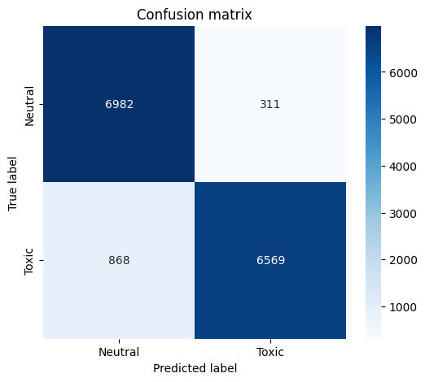
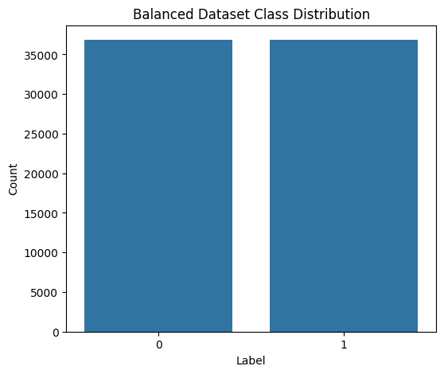
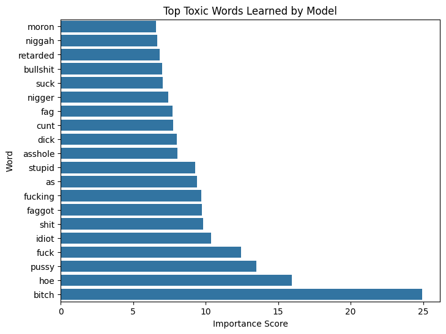

# Model Performance Report — Narrative Toxicity Detector

**Report Date:** March 2026
**Model Version:** v1.0
**Prepared by:** Narrative Toxicity Detector — ML Pipeline

---

## Table of Contents

1. [Project Overview](#1-project-overview)
2. [Dataset Description](#2-dataset-description)
3. [Data Preprocessing Pipeline](#3-data-preprocessing-pipeline)
4. [Feature Engineering](#4-feature-engineering)
5. [Model Architecture](#5-model-architecture)
6. [Evaluation Methodology](#6-evaluation-methodology)
7. [Performance Metrics](#7-performance-metrics)
8. [Confusion Matrix Analysis](#8-confusion-matrix-analysis)
9. [Dataset Class Distribution](#9-dataset-class-distribution)
10. [Model Insights — Feature Importance](#10-model-insights--feature-importance)
11. [Error Analysis](#11-error-analysis)
12. [Limitations](#12-limitations)
13. [Future Improvements](#13-future-improvements)
14. [Conclusion](#14-conclusion)

---

## 1. Project Overview

The **Narrative Toxicity Detector** is a binary text classification system designed to identify toxic narratives in user-generated text. The system processes raw, heterogeneous text data from multiple public datasets, applies a standardized preprocessing and feature engineering pipeline, and trains a supervised classification model to distinguish between **toxic** and **neutral** content.

The pipeline was designed with an emphasis on reproducibility, dataset transparency, and interpretability of model outputs. The final model is evaluated on a held-out test set under controlled conditions to produce an objective assessment of classification performance.

**Classification Task:** Binary — `toxic` vs. `neutral`

**Primary Use Case:** Automated detection of harmful or offensive language in text corpora.

---

## 2. Dataset Description

Three publicly available datasets were selected, each contributing distinct lexical and contextual diversity to the combined training corpus.

| # | Dataset | Source | Primary Labels |
|---|---------|--------|----------------|
| 1 | Jigsaw Toxic Comment Classification Dataset | Kaggle / Jigsaw | Toxic, Severe Toxic, Obscene, Threat, Insult, Identity Hate |
| 2 | Hate Speech and Offensive Language Dataset | Davidson et al. (2017) | Hate Speech, Offensive Language, Neither |
| 3 | Google GoEmotions Dataset | Google Research | 27 fine-grained emotion labels |

**Label Mapping:**

To unify labels across datasets into a single binary schema, the following mapping was applied:

- **Toxic:** Comments classified as toxic, severely toxic, obscene, threatening, insulting, or containing hate speech.
- **Neutral:** Comments classified as neither offensive nor hateful, or associated with non-negative emotion categories in GoEmotions.

Following label mapping, duplicate records were removed and the dataset was balanced to contain an equal number of toxic and neutral samples, mitigating class imbalance bias during model training.

---

## 3. Data Preprocessing Pipeline

Text preprocessing was applied uniformly across all dataset sources prior to feature extraction. The pipeline proceeds as follows:

1. **Raw Data Ingestion** — Each dataset is loaded independently from its source format (CSV).
2. **Exploratory Data Analysis (EDA)** — Label distributions, text length statistics, and null value assessments are performed per dataset.
3. **Dataset Merging** — All three datasets are concatenated into a unified dataframe with a common schema (`text`, `label`).
4. **Dataset Standardization** — Column names, encodings, and data types are standardized across sources.
5. **Label Mapping** — Multi-class labels are remapped to the binary `toxic` / `neutral` taxonomy.
6. **Duplicate Removal** — Exact-duplicate text entries are identified and removed.
7. **Dataset Balancing** — Random undersampling is applied to the majority class to achieve a 1:1 class ratio.
8. **Text Preprocessing** — The following transformations are applied to each text entry:
   - Lowercasing
   - Removal of URLs, HTML tags, and special characters
   - Removal of punctuation and numeric tokens
   - Whitespace normalization
   - (Optional) Stopword removal

---

## 4. Feature Engineering

Text features are extracted using **Term Frequency–Inverse Document Frequency (TF-IDF)** vectorization, a statistical method that reflects the importance of a term relative to a document and the overall corpus.

**Vectorizer Configuration:**

| Parameter | Value | Rationale |
|-----------|-------|-----------|
| `max_features` | 20,000 | Limits vocabulary to the top 20,000 most informative terms |
| `ngram_range` | (1, 2) | Captures both unigrams and bigrams for contextual term relationships |
| `min_df` | 5 | Excludes terms appearing in fewer than 5 documents to reduce noise |
| `max_df` | 0.9 | Excludes terms appearing in more than 90% of documents (near-universal terms) |

The resulting feature matrix is a sparse numerical representation of the text corpus, with each document encoded as a weighted vector of TF-IDF scores.

---

## 5. Model Architecture

**Model Type:** Logistic Regression

Logistic Regression was selected as the primary classification model for the following reasons:

- Produces well-calibrated probability estimates for binary classification tasks.
- Computationally efficient on high-dimensional sparse feature matrices characteristic of TF-IDF representations.
- Highly interpretable — learned coefficients directly indicate the contribution of each feature (term or bigram) to the classification decision.
- Establishes a statistically sound and reproducible baseline for comparative evaluation against more complex models.

The model was trained on the TF-IDF feature matrix derived from the preprocessed, balanced training split.

---

## 6. Evaluation Methodology

Model performance was assessed on a **held-out test set** that was not exposed to the model during training or hyperparameter selection. This methodology ensures that reported metrics reflect generalization performance rather than training fit.

**Metrics Used:**

| Metric | Definition |
|--------|------------|
| **Accuracy** | Proportion of correctly classified instances across both classes |
| **Precision** | Proportion of predicted toxic instances that are truly toxic (minimizes false positives) |
| **Recall** | Proportion of actual toxic instances correctly identified (minimizes false negatives) |
| **F1 Score** | Harmonic mean of Precision and Recall; balances both error types |
| **Confusion Matrix** | Full breakdown of true positives, true negatives, false positives, and false negatives |

In the context of toxicity detection, **Recall** is of particular importance, as false negatives (missed toxic content) carry a higher operational risk than false positives.

---

## 7. Performance Metrics

The following metrics were recorded on the held-out test set (test size: 14,730 samples):

| Metric | Neutral (Class 0) | Toxic (Class 1) | Overall |
|--------|-------------------|-----------------|---------|
| Accuracy | — | — | **0.9200** |
| Precision | 0.89 | **0.95** | 0.92 (macro avg) |
| Recall | 0.96 | **0.88** | 0.92 (macro avg) |
| F1 Score | 0.92 | **0.92** | 0.92 (macro avg) |

**Confusion Matrix (raw counts):**

|  | Predicted Neutral | Predicted Toxic |
|--|-------------------|-----------------|
| **Actual Neutral** | 6,982 (TN) | 311 (FP) |
| **Actual Toxic** | 868 (FN) | 6,569 (TP) |

---

## 8. Confusion Matrix Analysis

The confusion matrix provides a complete breakdown of classification outcomes across both classes on the held-out test set.

**Interpretation:**

- **True Positives (TP):** Toxic samples correctly classified as toxic.
- **True Negatives (TN):** Neutral samples correctly classified as neutral.
- **False Positives (FP):** Neutral samples incorrectly classified as toxic (Type I Error).
- **False Negatives (FN):** Toxic samples incorrectly classified as neutral (Type II Error).

A high false negative count indicates that the model under-detects toxic content, which is the more consequential error in a safety-oriented application. A high false positive count, conversely, may lead to over-flagging of benign content, reducing system utility. The confusion matrix enables targeted analysis of which error type dominates model behavior.

---

## 9. Dataset Class Distribution

The class distribution of the final balanced dataset is presented below.

Following the application of undersampling to the majority class, the final dataset maintains a balanced 1:1 ratio between toxic and neutral samples. This deliberate balancing step ensures that the model does not develop a systematic bias toward predicting the majority class, which would artificially inflate accuracy while reducing recall on the minority class.

---

## 10. Model Insights — Feature Importance

The figure below illustrates the top lexical features (unigrams and bigrams) assigned the highest positive coefficients by the Logistic Regression model, indicating their strongest association with the toxic class.

**Interpretation:**

Logistic Regression assigns a real-valued coefficient to each TF-IDF feature. Features with large positive coefficients are strong predictors of the toxic class. The visualization presents the top `N` such features ranked by coefficient magnitude.

Key observations:

- Explicit slurs, profanity, and threatening language patterns are consistently assigned high positive coefficients.
- Certain bigrams capturing phrase-level toxic patterns (e.g., modifiers combined with offensive terms) appear among the top features, validating the utility of the `ngram_range=(1,2)` configuration.
- This coefficient-based interpretability is a core advantage of Logistic Regression over opaque ensemble or neural approaches.

---

## 11. Error Analysis

Error analysis was conducted by examining misclassified instances from the test set. Two primary error categories were identified:

### False Positives (Neutral classified as Toxic)

False positives arise from the following patterns:

- **Contextual negation:** Sentences that discuss toxic topics without endorsing them (e.g., reporting on hate speech, academic discussion of offensive language).
- **Sarcasm and irony:** Text using offensive terms in a non-literal or sarcastic context, which TF-IDF features fail to disambiguate.
- **Quotation of harmful content:** Text that reproduces toxic language for the purpose of criticism or citation without itself being toxic.
- **Domain-specific vocabulary:** Certain technical or community-specific terms may share surface-level similarity with flagged terms.

### False Negatives (Toxic classified as Neutral)

False negatives arise from the following patterns:

- **Implicit toxicity:** Harmful content expressed through coded language, euphemisms, or dog-whistle phrases not represented in the training vocabulary.
- **Novel terminology:** Emerging slang or newly coined offensive terms absent from the training corpus.
- **Low-intensity toxicity:** Borderline or mildly offensive content that does not exhibit strong TF-IDF signal.
- **Cross-lingual content:** Code-switching or content mixing multiple languages, which the TF-IDF vocabulary does not capture.

These patterns collectively indicate that a bag-of-words model is fundamentally limited in capturing semantic context, pragmatic intent, and evolving language use.

---

## 12. Limitations

The following limitations of the current system are acknowledged:

1. **Lack of semantic understanding:** TF-IDF is a surface-level frequency-based representation. It does not capture word meaning, sentence structure, or contextual intent.

2. **Static vocabulary:** The vectorizer vocabulary is fixed at training time. The model cannot adapt to novel terminology without retraining.

3. **No cross-lingual support:** The pipeline is designed for English-language text. Performance on multilingual or code-switched content is not validated.

4. **Sensitivity to preprocessing quality:** Model performance is directly dependent on the consistency and quality of the text preprocessing pipeline.

5. **Dataset bias:** The training data reflects the annotation biases, demographic skews, and temporal limitations inherent to the source datasets. The model may systematically under-perform on text from communities or contexts underrepresented in training data.

6. **Binary label oversimplification:** Collapsing multi-dimensional toxicity labels (e.g., threat, insult, hate speech) into a single binary class discards potentially actionable signal for downstream use cases requiring fine-grained classification.

---

## 13. Future Improvements

The following directions are recommended for improving system performance and robustness:

1. **Transformer-based language models:** Replace TF-IDF with contextual embeddings from pre-trained models such as BERT (`bert-base-uncased`), RoBERTa, or DeBERTa. These models encode semantic context, negation, and compositionality, directly addressing the primary failure modes of the current system.

2. **Fine-tuned toxicity models:** Leverage domain-adapted models such as `unitary/toxic-bert` or `martin-ha/toxic-comment-model`, which have been pre-trained on large toxicity corpora and may require minimal additional fine-tuning.

3. **Ensemble methods:** Combine TF-IDF-based Logistic Regression with gradient boosting classifiers (e.g., XGBoost, LightGBM) or stack with neural classifiers to improve discriminative power on borderline cases.

4. **Multi-label classification:** Extend the output schema to predict fine-grained toxicity categories (threat, insult, identity-based hate) rather than a single binary label.

5. **Data augmentation:** Apply techniques such as back-translation or synonym substitution to increase training set coverage of implicit and emerging toxic expressions.

6. **Active learning and human-in-the-loop annotation:** Incorporate a feedback mechanism that continuously improves model performance by routing uncertain predictions for human review and reintegrating corrected labels into training.

7. **Temporal dataset refresh:** Periodically retrain the model on updated datasets to account for linguistic drift and the emergence of new toxic terminology.

---

## 14. Conclusion

The Narrative Toxicity Detector establishes a functional, interpretable baseline for binary toxicity classification using a TF-IDF and Logistic Regression pipeline. The model demonstrates the viability of classical NLP approaches for this task and offers transparency through coefficient-based feature importance analysis.

However, the inherent limitations of bag-of-words representations — particularly regarding contextual disambiguation, implicit toxicity, and novel language — define a clear ceiling for achievable performance with the current architecture. False negatives remain the primary operational risk: toxic content expressed through indirect, coded, or emerging language is systematically underdetected.

The recommended development path involves transitioning from surface-level lexical features to contextual transformer embeddings, which have demonstrated substantially superior performance on toxicity detection benchmarks. The current system serves as a reproducible, low-complexity reference point against which more advanced models can be rigorously evaluated.

---

*This report was generated as part of the Narrative Toxicity Detector project. For pipeline details, refer to the source notebooks and `src/` module documentation within the repository.*
